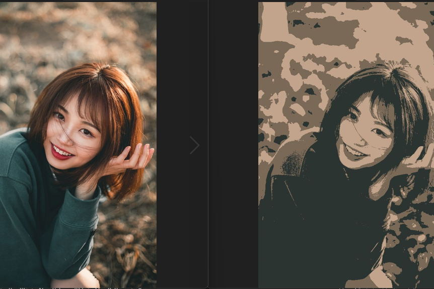

# Compress-image-with-K-means-clustering
This is a simple program to show you how to use scikit-learn to compress a image by choose the most common colors from the original picture.(Same dimension) 
Change the n_cluster to the number of colors you want the output picture to show off 
Processing time depends on the number of clusters you set. 
The default input picture is input.png you can change it to another if you want. result.jpg will be the output.
(Just remember to match the name of picture with the name of files in main.py.)  

